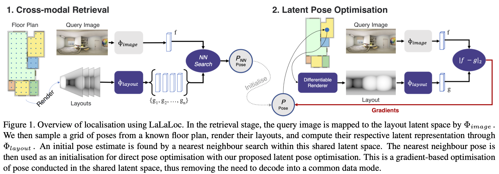

# Overview

This is the code repository for LaLaLoc and LaLaLoc++


* We currently provide training and evaluation code for LaLaLoc, for both the Image-to-Layout and Layout-to-Layout configurations. 

* Code for LaLaLoc++ is coming soon!


## LaLaLoc++: Global Floor Plan Comprehension for Layout Localisation in Unvisited Environments
**Henry Howard-Jenkins and Victor Adrian Prisacariu**
**(ECCV 2022)**

[Project Page](https://lalalocpp.active.vision) | Paper(coming soon!)


## LaLaLoc: Latent Layout Localisation in Dynamic, Unvisited Environments
**Henry Howard-Jenkins, Jose-Raul Ruiz-Sarmiento and Victor Adrian Prisacariu**
**(ICCV 2021)**

[Project Page](https://lalaloc.active.vision) | [Paper](https://arxiv.org/abs/2104.09169)




# Setup
## Installing Requirements

* Create conda environment:
```
conda create -n lalaloc python==3.8
conda activate lalaloc
```
* Install PyTorch:
```
conda install pytorch==1.7.1 torchvision==0.8.2 cudatoolkit=10.1 -c pytorch
```
* Install Pytorch Lightning:
```
conda install -c conda-forge pytorch-lightning==1.1.5
```
* Install Pytorch3d:
```
conda install -c fvcore -c iopath -c conda-forge fvcore iopath
conda install -c bottler nvidiacub
conda install -c pytorch3d pytorch3d==0.4.0 
```
* Install Pymesh
    * Follow build and install instructions: https://github.com/PyMesh/PyMesh
* Install Redner:
```
pip install redner-gpu
```

## Download the Structured3D Dataset
* Information provided here: https://github.com/bertjiazheng/Structured3D

# Usage
### Layout Branch
* Train layout branch
```
python train.py -c configs/layout_branch.yaml \
    DATASET.PATH [path/to/dataset]
```
* Test layout branch:
    * Perform evaluation of the trained layout branch on a sampled grid of 0.5m with VDR and LPO.
```
python train.py -c configs/layout_branch.yaml -t [path/to/checkpoint] \
    DATASET.PATH [path/to/dataset] \
    SYSTEM.NUM_GPUS 1 \
    TEST.VOGEL_DISC_REFINE True \
    TEST.LATENT_POSE_OPTIMISATION True \
    TEST.POSE_SAMPLE_STEP 500
```

### Image Branch
* Train image branch
    * Perform training of the image branch with the layout branch from a previous training run.
```
python train.py -c configs/image_branch.yaml \
    DATASET.PATH [path/to/dataset] \
    TRAIN.SOURCE_WEIGHTS [path/to/layout_branch_checkpoint]
```

* Test image branch
```
python train.py -c configs/image_branch.yaml -t [path/to/checkpoint] \
    DATASET.PATH [path/to/dataset] \
    SYSTEM.NUM_GPUS 1 \
    TEST.VOGEL_DISC_REFINE True \
    TEST.LATENT_POSE_OPTIMISATION True \
    TEST.POSE_SAMPLE_STEP 500
```

# Citations
```
@article{howard2021lalaloc++,
  title={LaLaLoc++: Global Floor Plan Comprehension for Layout Localisation in Unvisited Environments},
  author={Howard-Jenkins, Henry and Prisacariu, Victor Adrian},
  booktitle={Proceedings of the European Conference on Computer Vision},
  pages={},
  year={2022}
}
```
```
@article{howard2022lalaloc++,
  title={LaLaLoc++: Global Floor Plan Comprehension for Layout Localisation in Unvisited Environments},
  author={Howard-Jenkins, Henry and Prisacariu, Victor Adrian},
  booktitle={Proceedings of the European Conference on Computer Vision},
  pages={},
  year={2022}
}
```