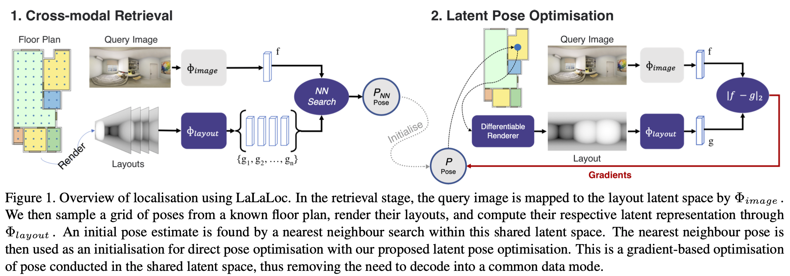

## Abstract
We present LaLaLoc to localise in environments without the need for prior visitation, and in a manner that is robust to large changes in scene appearance, such as a full rearrangement of furniture. Specifically, LaLaLoc performs localisation through latent representations of room layout. LaLaLoc learns a rich embedding space shared between RGB panoramas and layouts inferred from a known floor plan that encodes the structural similarity between locations. Further, LaLaLoc introduces direct, cross-modal pose optimisation in its latent space. Thus, LaLaLoc enables fine-grained pose estimation in a scene without the need for prior visitation, as well as being robust to dynamics, such as a change in furniture configuration. We show that in a domestic environment LaLaLoc is able to accurately localise a single RGB panorama image to within 8.3cm, given only a floor plan as a prior.

## Code

The code for reproducing results in the paper can be obtained from the [GitHub repository](https://github.com/ActiveVisionLab/LaLaLoc).

## Citation

BiBTeX:

```
@article{howard2021lalaloc,
  title={LaLaLoc: Latent Layout Localisation in Dynamic, Unvisited Environments},
  author={Howard-Jenkins, Henry and Ruiz-Sarmiento, Jose-Raul and Prisacariu, Victor Adrian},
  booktitle={Proceedings of the IEEE International Conference on Computer Vision},
  pages={},
  year={2021}
}
```